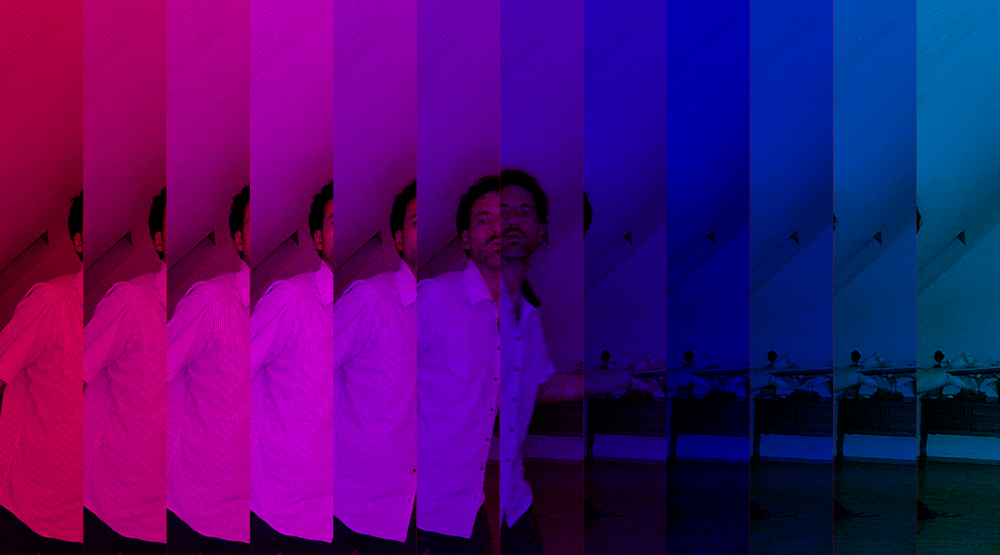

# Walking Piece, Yoko Ono

WALKING PIECE
Walk in the footsteps of the person in front.

1. on ground
2. in mud
3. in snow
4. on ice
5. in water

Try not to make sounds.
1964 spring

## Description

This interactive web application is inspired by Yoko Ono's conceptual art piece "Walking Piece" from 1964. The project creates a digital interpretation of following in someone's footsteps through a real-time camera-based visual experience.

The application captures live video from your camera and creates delayed visual "slices" that move across the screen, creating a trail effect that represents the concept of walking in someone's footsteps. As you move in front of the camera, your past movements are rendered as delayed slices, creating a visual metaphor for the temporal nature of following and being followed.

### Features

- **Real-time Camera Capture**: Uses your device's camera to capture live video
- **Delayed Visual Slices**: Creates temporal slices of your movement with adjustable delay
- **Interactive Controls**: Slider to adjust the number of slices (2-120) for different visual effects

### How to Use

1. Allow camera permissions when prompted
2. Stand in front of your camera
3. Move around to see the delayed slice effect
4. Adjust the slice slider to change the number of temporal slices
5. Experience the concept of following your own footsteps through time

---
